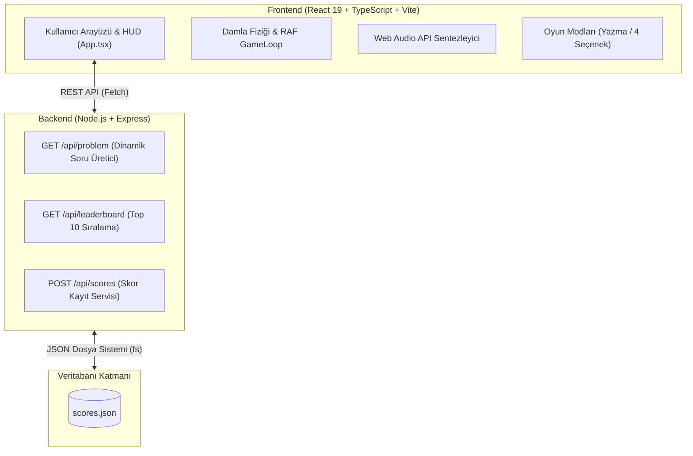

# 🌧️ Raindrops — Zihinsel Matematik & Refleks Oyunu

[](https://react.dev/)
[](https://nodejs.org/)
[](https://www.typescriptlang.org/)
[](https://vitejs.dev/)
[](LICENSE)

**Raindrops**, gökten süzülen matematik problemlerini doğru çözerek refleks ve işlem hızınızı test ettiğiniz, zengin görsel atmosfer ve dinamik ses efektleriyle donatılmış **Full-Stack** bir web oyunudur.

Lumosity'nin popüler beyin egzersizlerinden esinlenilmiş, modern web teknolojileri (React 19, TypeScript, Node.js, Web Audio API) ile sıfırdan geliştirilmiştir.

---

## 📸 Ekran Görüntüleri & Özellikler

### 🎮 1. İki Farklı Oyun Modu
- **⌨️ Yazarak Oyna:** Klavyeden cevabı yazıp Enter'a basarak refleksleri ve yazma hızını test edin.
- **👆 Seçerek Oyna:** Özellikle dokunmatik ve hızlı oynanış için altta beliren 4 dinamik seçenek arasından doğru olanına dokunarak oynayın.

### 💧 2. Çoklu Damla Türleri & Boss Dalgası
- **Normal Damla:** Standart düşüş hızı (+1 Puan).
- **❄️ Buz Damlası:** %50 daha yavaş düşer, rahat işlem yapma fırsatı sunar (+2 Puan).
- **⚡ Fırtına Damlası:** %30 daha hızlı düşer, yüksek refleks gerektirir (+3 Puan).
- **💎 Bonus Damla:** Nadir çıkar, doğru cevaplandığında **+1 Can** kazandırır.
- **👑 Boss Dalgası:** Her 3 seviyede bir devasa mor parıltılı Boss damlası belirir (+5 Puan ve +1 Can).

### ⚡ 3. Görsel Atmosfer & Dinamik Efektler
- **🌩️ Seviyeye Göre Kararan Gökyüzü:** Seviye yükseldikçe arka plan rengi hafif maviden karanlık fırtınaya dönüşür.
- **⚡ Gerçekçi Şimşek Efektleri:** İleri seviyelerde rastgele SVG şimşekleri çakar ve ekran parlar.
- **✨ Parçacık Patlaması (Particles):** Doğru cevaplanan her damla türünün renginde parçacıklara ayrılarak yok olur.
- **💥 Baskı Bonusu (Time Pressure):** Damla zemine yaklaşırken çözülürse **2x Puan** çarpanı uygulanır.

### 🎵 4. Web Audio API ile Prosedürel Ses & Müzik
- **🌧️ Atmosferik Yağmur Hışırtısı:** Filtrelenmiş white-noise sentezleyici ile arka planda gerçekçi yağmur sesi.
- **🎶 Prosedürel Melodi & Drone:** Pentatonik skala bas drone ve ambient synthesizer melodisi.
- **🔊 Ses On/Off Butonu:** HUD üzerinden tek tıkla tüm sesler açılıp kapatılabilir.

### 🔥 5. Motivasyon Sloganları & Başarımlar
- **Combo Sloganları:** Seri yaptıkça ekranda `GOOD! 👍`, `GREAT! ✨`, `AMAZING! 🔥`, `UNSTOPPABLE! 💥`, `LEGENDARY! 🚀` sloganları parlar.
- **🏆 Rozet & Başarım Sistemi:** 6 farklı başarım kilidi toast bildirimleriyle açılır.

### 🗄️ 6. Full-Stack Liderlik Tablosu (Leaderboard)
- Node.js sunucusunda `scores.json` veritabanında saklanan **Top 10 Liderlik Tablosu**.
- 🥇 1., 🥈 2., 🥉 3. sıra madalyaları, skor, ulaşılan seviye ve oyun modu kaydı.

---

## 🏗️ Proje Mimarisi



---

## 🚀 Kurulum ve Çalıştırma

Projeyi yerel ortamınızda çalıştırmak için aşağıdaki adımları izleyin:

### Gereksinimler
- [Node.js](https://nodejs.org/) (v18 veya üzeri tavsiye edilir)
- `npm` (Node ile birlikte gelir)

### 1. Depoyu İndirin ve Bağımlılıkları Yükleyin
```bash
# Bağımlılıkları yükleyin
npm install
```

### 2. Tek Komutla Hem Sunucuyu Hem İstemciyi Başlatın
```bash
npm run dev
# veya
npm start
```

Bu komut `concurrently` paketi sayesinde:
1. **Node.js Express API Sunucusunu** `http://localhost:4000` portunda,
2. **React Vite İstemcisini** `http://localhost:5173` portunda

aynı anda başlatacaktır.

Tarayıcınızda **`http://localhost:5173`** adresine giderek oynamaya başlayabilirsiniz!

---

## 📡 REST API Endpoint'leri

| Metot | Endpoint | Açıklama |
| :--- | :--- | :--- |
| `GET` | `/api/problem?level=N` | Seviyeye göre zorlaşan matematik problemi üretir (`+`, `-`, `*`, `/`). |
| `GET` | `/api/leaderboard` | En yüksek 10 skoru azalan sırada getirir. |
| `POST` | `/api/scores` | Yeni skoru veritabanına kaydeder ve sıralama derecesini döner. |
| `GET` | `/api/health` | Sunucu sağlık kontrolü (`{ "status": "ok" }`). |

---

## 📂 Dosya Yapısı

```text
├── App.tsx          # Ana React oyunu, fizik döngüsü, ses motoru ve UI
├── main.tsx         # React DOM kök render noktası
├── index.html       # HTML giriş sayfası
├── server.js        # Node.js + Express backend ve REST API servisleri
├── scores.json      # Liderlik tablosu veritabanı dosyası
├── package.json     # Proje bağımlılıkları ve çalıştırma betikleri
├── tsconfig.json    # TypeScript yapılandırması
├── vite.config.ts   # Vite geliştirme ve derleme yapılandırması
└── README.md        # Proje dökümantasyonu
```

---

## 🛠️ Kullanılan Teknolojiler & Araçlar

- **Frontend:** React 19, TypeScript, Vite, CSS-in-JS & CSS3 Keyframes
- **Backend:** Node.js, Express.js, CORS
- **Ses & Müzik:** Web Audio API (Oscillator, BiquadFilter, BufferSource)
- **Veri Saklama:** Node.js File System (`scores.json`), Browser `localStorage`
- **Geliştirme & AI Desteği:** Google Antigravity
- **Geliştirici Araçları:** TypeScript Compiler, Concurrently, Git

---

## 💡 İlham Kaynağı & Atıflar

- **Oyun Konsepti:** Bu proje, **Lumosity** platformunun popüler zihinsel egzersiz oyunu olan *Raindrops (Yağmur Damlaları)* temel alınarak tasarlanmış; üzerine yeni damla türleri (Buz, Fırtına, Boss), iki farklı oyun modu (Yazma & 4 Seçenek), prosedürel Web Audio yağmur/melodi sentezleyicisi, dinamik şimşek efektleri ve Full-Stack REST API Liderlik Tablosu eklenerek kapsamlı bir şekilde geliştirilmiştir.
- **Yapay Zeka Destekli Geliştirme:** Projenin mimari tasarımı, kodlama, optimizasyon ve hata ayıklama süreçlerinde **Google Antigravity** yapay zeka kodlama asistanından yardım alınmıştır.

---

## 👩‍💻 Geliştirici

- **Merve Çiltepe**
- GitHub: [@merve-ciltepe](https://github.com/merve-ciltepe)

---

⭐ Projeyi beğendiyseniz yıldız vermeyi unutmayın!

